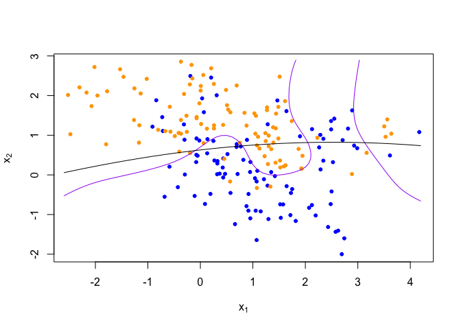

Homework 1
================
Painter, Ty
Sun Feb 14 21:07:45 2021

**Using the RMarkdown/knitr/github mechanism, implement the following
tasks by extending the example R script mixture-data-lin-knn.R:**

  - Paste the code from the mixture-data-lin-knn.R file into the
    homework template Knitr document.
  - Read the help file for R’s built-in linear regression function lm

<!-- end list -->

``` r
library('class') # has knn fucntion
library('dplyr') # data manipulation...tidyverse
```

    ## 
    ## Attaching package: 'dplyr'

    ## The following objects are masked from 'package:stats':
    ## 
    ##     filter, lag

    ## The following objects are masked from 'package:base':
    ## 
    ##     intersect, setdiff, setequal, union

``` r
## load binary classification example data from author website 
## 'ElemStatLearn' package no longer available
load(url('https://web.stanford.edu/~hastie/ElemStatLearn/datasets/ESL.mixture.rda'))
dat <- ESL.mixture # list

plot_mix_data <- expression({ # expression = piece of code not evaluated; could write as a function
  plot(dat$x[,1], dat$x[,2], # plot plots x1 on x-axis and x2 on y-axis
       col=ifelse(dat$y==0, 'blue', 'orange'),
       pch=20, 
       xlab=expression(x[1]),
       ylab=expression(x[2]))
  ## draw Bayes (True) classification boundary
  prob <- matrix(dat$prob, length(dat$px1), length(dat$px2)) # dat$prob = prob of orange
  cont <- contourLines(dat$px1, dat$px2, prob, levels=0.5) # countour of certain value of prob (=0.5), can adjust levels to whatever prob we want
  rslt <- sapply(cont, lines, col='purple') # plots contour line, farther away from the 0.5 countour line is higher prob
})

eval(plot_mix_data) # evaluates expression above
```

<!-- -->

  - Re-write the functions fit\_lc and predict\_lc using lm, and the
    associated predict method for lm objects.
  - Consider making the linear classifier more flexible, by adding
    squared terms for x1 and x2 to the linear model

<!-- end list -->

``` r
fit_lc_lm <- function(y,x){
  df<- data.frame(y=y, x1=x[,1], x2=x[,2]) # create df to pass into lm()
  fit<- lm(y~poly(x1,2)+poly(x2,2), data = df) # poly returns squared polynomials of x1 and x2
  return(fit)
}
predict_lc_lm <- function(x, fit) {
  xs<- data.frame(x1=x[,1], x2=x[,2]) # create df to pass into predict()
  predict(fit,xs)
}
lc_beta_lm <- fit_lc_lm(dat$y, dat$x) # linear model of y, x1, x2, x1+x1^2, x2+x2^2
lc_pred_lm <- predict(lc_beta_lm, newdata=data.frame(dat$xnew)) # predict y for new x1, x2 values
## reshape predictions as a matrix
lc_pred_lm <- matrix(lc_pred_lm, nrow=length(dat$px1), ncol=length(dat$px2)) # surface predicted by linear classifier model (69x99 matrix)
contour(lc_pred_lm, # 0.5 show decision line, y-hat surface
      xlab=expression(x[1]), # hard to use linear classifier when prob can be >1 and <0
      ylab=expression(x[2]))
```

<!-- -->

``` r
## find the contours in 2D space such that lc_pred_lm = 0.5
lc_cont_lm <- contourLines(dat$px1, dat$px2, lc_pred_lm, levels=0.5)
## plot data and decision surface
eval(plot_mix_data) # 0.5 contour line
sapply(lc_cont_lm, lines) # linear decision line
```

<!-- -->

    ## [[1]]
    ## NULL

  - Describe how this more flexible model affects the bias-variance
    tradeoff
    
    Squaring both predictor values (x1 and x2) caused the decision line
    to become more biased but also lowered the variance. The new contour
    plot is arched into a convex shape. The bias of this line becomes
    higher since the Bayes decision boundary is far from a straight
    line, which was represented by the original contour plot. However,
    as the bias decreases the variance increases. As the probabilities
    of orange increase, the degree of curvature among the contour lines
    also increase.
