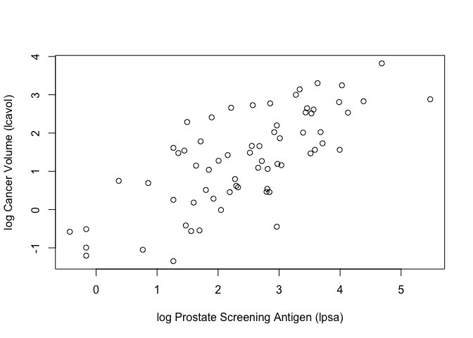
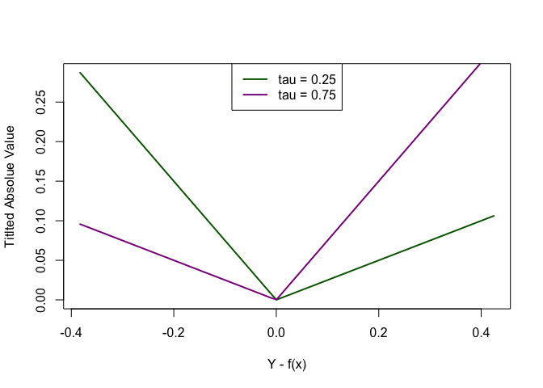
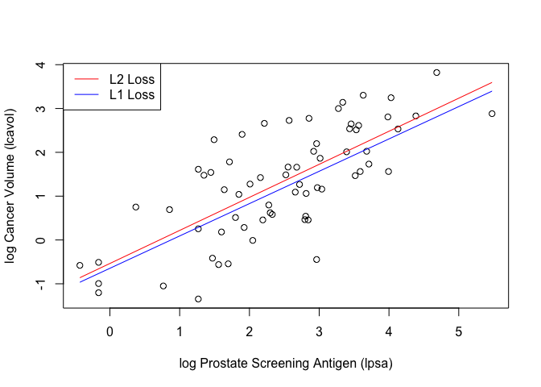
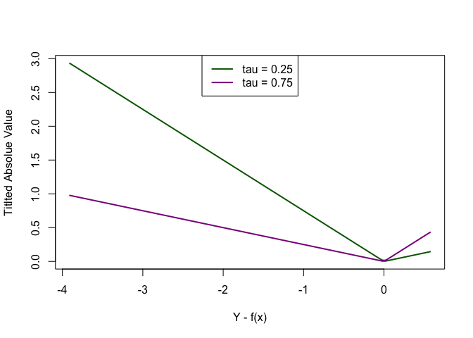
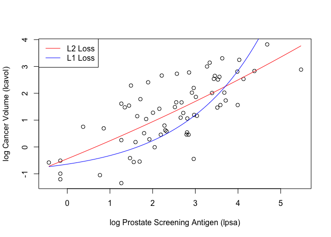

Homework 2
================
Painter, Ty
Sun Feb 14 20:49:13 2021

**Using the RMarkdown/knitr/github mechanism, implement the following
tasks by extending the example R script ( prostate-data-lin.R):**

``` r
library(devtools)
```

    ## Loading required package: usethis

``` r
## load prostate data

prostate <-read.table(url('https://web.stanford.edu/~hastie/ElemStatLearn/datasets/prostate.data'))

## subset to training examples
prostate_train <- subset(prostate, train==TRUE)

## plot lcavol vs lpsa
plot_psa_data <- function(dat=prostate_train) {
  plot(dat$lpsa, dat$lcavol,
       xlab="log Prostate Screening Antigen (lpsa)",
       ylab="log Cancer Volume (lcavol)")
}
plot_psa_data()
```

<!-- -->

  - Write functions that implement the L1 loss and tilted absolute loss
    functions.

<!-- end list -->

``` r
## L2 loss function, squared error loss
L2_loss <- function(y, yhat)
  (y-yhat)^2

## L1 loss function, absolute error loss
L1_loss <- function(y, yhat)
  abs(y-yhat)

## fit simple linear model using numerical optimization
fit_lin_L2 <- function(y, x, loss=L2_loss, beta_init = c(-0.51, 0.75)) { # estimates beta1 and beta2; beta minimizes residual squares
  err2 <- function(beta) # calculates avg L2 loss function
    mean(loss(y,  beta[1] + beta[2]*x)) # yhat = beta[1] + beta[2]*x
  
  beta <- optim(par = beta_init, fn = err2) # want to minimize fn, optimize between (-0.51, 0.75), err is initial value 
  
  return(beta) # values of beta that minimize training error, uses gradient method
}

## fit simple linear model using numerical optimization
fit_lin_L1 <- function(y, x, loss=L1_loss, beta_init = c(-0.51, 0.75)) { # estimates beta1 and beta2; beta minimizes residual squares
  err1 <- function(beta) # calculates avg L2 loss function
    median(loss(y,  beta[1] + beta[2]*x)) # yhat = beta[1] + beta[2]*x
  
  beta <- optim(par = beta_init, fn = err1) # want to minimize fn, optimize between (-0.51, 0.75), err is initial value 
  
  return(beta) # values of beta that minimize training error, uses gradient method
}

## make predictions from linear model
predict_lin <- function(x, beta)
  beta[1] + beta[2]*x

## fit linear model - estimates betas to minimize training error
lin_beta_L2 <- fit_lin_L2(y=prostate_train$lcavol,
                    x=prostate_train$lpsa,
                    loss=L2_loss)

## fit linear model - estimates betas to minimize training error
lin_beta_L1 <- fit_lin_L1(y=prostate_train$lcavol,
                    x=prostate_train$lpsa,
                    loss=L1_loss)

## compute predictions for a grid of inputs
x_grid <- seq(min(prostate_train$lpsa),
              max(prostate_train$lpsa),
              length.out=100)
y_grid <- seq(from=min(prostate_train$lcavol),
              to=max(prostate_train$lcavol),
              length.out=100)

lin_pred_L2 <- predict_lin(x=x_grid, beta=lin_beta_L2$par) # generates yhat (yhat = beta[1] + beta[2]*x)
lin_pred_L1 <- predict_lin(x=x_grid, beta=lin_beta_L1$par) # generates yhat (yhat = beta[1] + beta[2]*x)

## tilted absolute loss function
tilt <- function(y, yhat, tau){
 tav = ifelse(y-yhat>0, tau*(y-yhat), (tau-1)*(y-yhat))
 return(tav)
}

tau25 = tilt(y=y_grid, yhat=lin_pred_L1, tau=0.25) # tilted absolute values for tau = 0.25
tau75 = tilt(y=y_grid, yhat=lin_pred_L1, tau=0.75) # tilted absolute values for tau = 0.75
```

  - Create a figure that shows lpsa (x-axis) versus lcavol (y-axis). Add
    and label (using the ‘legend’ function) the linear model predictors
    associated with L2 loss, L1 loss, and tilted absolute value loss for
    tau = 0.25 and 0.75.

<!-- end list -->

``` r
## L2 loss function, squared error loss
L2_loss <- function(y, yhat)
  (y-yhat)^2

## L1 loss function, absolute error loss
L1_loss <- function(y, yhat)
  abs(y-yhat)

## plot tilted absolute loss values
plot(x = y_grid-lin_pred_L1, y = tau25, col="darkgreen", typ="l", lwd=2,
     ylab="Titlted Absolue Value",
     xlab="Y - f(x)")
lines(x = y_grid-lin_pred_L1, y = tau75, col="darkmagenta", lwd=2)
legend("top",
       legend = c("tau = 0.25", "tau = 0.75"),
       col = c("darkgreen", "darkmagenta"),
       lty = 1, lwd=2)
```

<!-- -->

``` r
## plot data
plot_psa_data()
## plot L1 & L2 predictions
lines(x=x_grid, y=lin_pred_L2, col="red")
lines(x=x_grid, y=lin_pred_L1, col="blue")
legend("topleft",
       legend = c("L2 Loss", "L1 Loss"),
       col = c("red", "blue"),
       lty = 1)
```

<!-- -->

  - Write functions to fit and predict from a simple nonlinear model
    with three parameters defined by ‘beta\[1\] +
    beta\[2\]*exp(-beta\[3\]*x)’. Hint: make copies of ‘fit\_lin’ and
    ‘predict\_lin’ and modify them to fit the nonlinear model. Use
    c(-1.0, 0.0, -0.3) as ‘beta\_init’.

<!-- end list -->

``` r
## L2 loss function, squared error loss
L2_loss <- function(y, yhat)
  (y-yhat)^2

## L1 loss function, absolute error loss
L1_loss <- function(y, yhat)
  abs(y-yhat)

## fit simple linear model using numerical optimization
fit_lin_L2_NL <- function(y, x, loss=L2_loss, beta_init = c(-1.0, 0.0, -0.3)) { # estimates beta1 and beta2; beta minimizes residual squares
  err2 <- function(beta) # calculates avg L2 loss function
    mean(loss(y,  beta[1] + beta[2]*exp(-beta[3]*x))) # yhat = beta[1] + beta[2]*exp(-beta[3]*x)
  
  beta <- optim(par = beta_init, fn = err2) # want to minimize fn, optimize between (-0.51, 0.75), err is initial value 
  
  return(beta) # values of beta that minimize training error, uses gradient method
}

## fit simple linear model using numerical optimization
fit_lin_L1_NL <- function(y, x, loss=L1_loss, beta_init = c(-1.0, 0.0, -0.3)) { # estimates beta1 and beta2; beta minimizes residual squares
  err1 <- function(beta) # calculates avg L2 loss function
    median(loss(y,  beta[1] + beta[2]*exp(-beta[3]*x))) # yhat = beta[1] + beta[2]*exp(-beta[3]*x)
  
  beta <- optim(par = beta_init, fn = err1) # want to minimize fn, optimize between (-0.51, 0.75), err is initial value 
  
  return(beta) # values of beta that minimize training error, uses gradient method
}

## make predictions from linear model
predict_lin_NL <- function(x, beta)
  beta[1] + beta[2]*exp(-beta[3]*x)

## fit linear model - estimates betas to minimize training error
lin_beta_L2_NL <- fit_lin_L2_NL(y=prostate_train$lcavol,
                    x=prostate_train$lpsa,
                    loss=L2_loss)

## fit linear model - estimates betas to minimize training error
lin_beta_L1_NL <- fit_lin_L1_NL(y=prostate_train$lcavol,
                    x=prostate_train$lpsa,
                    loss=L1_loss)

## compute predictions for a grid of inputs
x_grid <- seq(min(prostate_train$lpsa),
              max(prostate_train$lpsa),
              length.out=100)
y_grid <- seq(from=min(prostate_train$lcavol),
              to=max(prostate_train$lcavol),
              length.out=100)


lin_pred_L2_NL <- predict_lin_NL(x=x_grid, beta=lin_beta_L2_NL$par) # generates yhat (yhat = beta[1] + beta[2]*x)
lin_pred_L1_NL <- predict_lin_NL(x=x_grid, beta=lin_beta_L1_NL$par) # generates yhat (yhat = beta[1] + beta[2]*x)

## tilted absolute loss function
tilt <- function(y, yhat, tau){
 tav = ifelse(y-yhat>0, tau*(y-yhat), (tau-1)*(y-yhat))
 return(tav)
}

tau25_NL = tilt(y=y_grid, yhat=lin_pred_L1_NL, tau=0.25) # tilted absolute values for tau = 0.25
tau75_NL = tilt(y=y_grid, yhat=lin_pred_L1_NL, tau=0.75) # tilted absolute values for tau = 0.75
```

  - Create a figure that shows lpsa (x-axis) versus lcavol (y-axis). Add
    and label (using the ‘legend’ function) the nonlinear model
    predictors associated with L2 loss, L1 loss, and tilted absolute
    value loss for tau = 0.25 and 0.75.

<!-- end list -->

``` r
## plot tilted absolute loss values
plot(x = y_grid-lin_pred_L1_NL, y = tau25_NL, col="darkgreen", typ="l", lwd=2,
     ylab="Titlted Absolue Value",
     xlab="Y - f(x)")
lines(x = y_grid-lin_pred_L1_NL, y = tau75_NL, col="darkmagenta", lwd=2)
legend("top",
       legend = c("tau = 0.25", "tau = 0.75"),
       col = c("darkgreen", "darkmagenta"),
       lty = 1, lwd=2)
```

<!-- -->

``` r
## plot data
plot_psa_data()
## plot L1 & L2 predictions
lines(x=x_grid, y=lin_pred_L2_NL, col="red")
lines(x=x_grid, y=lin_pred_L1_NL, col="blue")
legend("topleft",
       legend = c("L2 Loss", "L1 Loss"),
       col = c("red", "blue"),
       lty = 1)
```

<!-- -->
