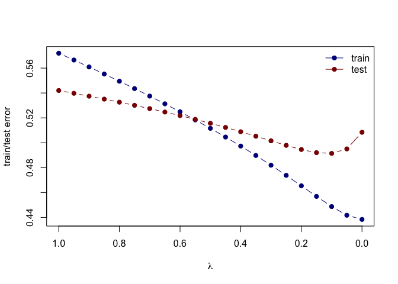

Homework 3
================
Painter, Ty
Thu Feb 25 08:23:34 2021

# Using the RMarkdown/knitr/github mechanism, implement the following tasks:

  - Use the prostate cancer data.

<!-- end list -->

``` r
prostate <-read.table(url('https://web.stanford.edu/~hastie/ElemStatLearn/datasets/prostate.data'))
prostate_train <- subset(prostate, train==TRUE) # 2/3 for train, 1/3 test
```

  - Use the cor function to reproduce the correlations listed in HTF
    Table 3.1, page 50.

<!-- end list -->

``` r
prostate.x <- prostate_train[,c("lweight", "age", "lbph", "svi", "lcp", "gleason", "pgg45")]
prostate.y <- prostate_train[,c("lcavol", "lweight", "age", "lbph", "svi", "lcp", "gleason")]
cor_table <- round(cor(prostate.x, prostate.y),3)

cor_table[upper.tri(cor_table)]<-""
cor_table<-as.data.frame(cor_table)
cor_table
```

    ##         lcavol lweight   age   lbph   svi   lcp gleason
    ## lweight    0.3                                         
    ## age      0.286   0.317                                 
    ## lbph     0.063   0.437 0.287                           
    ## svi      0.593   0.181 0.129 -0.139                    
    ## lcp      0.692   0.157 0.173 -0.089 0.671              
    ## gleason  0.426   0.024 0.366  0.033 0.307 0.476        
    ## pgg45    0.483   0.074 0.276  -0.03 0.481 0.663   0.757

  - Treat lcavol as the outcome, and use all other variables in the data
    set as predictors.
  - With the training subset of the prostate data, train a least-squares
    regression model with all predictors using the lm function.

<!-- end list -->

``` r
## predict lcavol consider all other predictors
## lm fits using L2 loss
ls_model <- lm(lcavol ~ ., data=prostate_train) # . means use to predict everything
summary(ls_model)
```

    ## 
    ## Call:
    ## lm(formula = lcavol ~ ., data = prostate_train)
    ## 
    ## Residuals:
    ##      Min       1Q   Median       3Q      Max 
    ## -1.71027 -0.50138  0.03103  0.51352  1.35376 
    ## 
    ## Coefficients: (1 not defined because of singularities)
    ##              Estimate Std. Error t value Pr(>|t|)    
    ## (Intercept) -2.173357   1.526699  -1.424    0.160    
    ## lweight     -0.113370   0.236639  -0.479    0.634    
    ## age          0.020102   0.013571   1.481    0.144    
    ## lbph        -0.056981   0.072525  -0.786    0.435    
    ## svi          0.035116   0.313526   0.112    0.911    
    ## lcp          0.418455   0.099521   4.205 9.16e-05 ***
    ## gleason      0.224387   0.198812   1.129    0.264    
    ## pgg45       -0.009113   0.005451  -1.672    0.100 .  
    ## lpsa         0.575455   0.107235   5.366 1.47e-06 ***
    ## trainTRUE          NA         NA      NA       NA    
    ## ---
    ## Signif. codes:  0 '***' 0.001 '**' 0.01 '*' 0.05 '.' 0.1 ' ' 1
    ## 
    ## Residual standard error: 0.7116 on 58 degrees of freedom
    ## Multiple R-squared:  0.7118, Adjusted R-squared:  0.672 
    ## F-statistic:  17.9 on 8 and 58 DF,  p-value: 3.999e-13

``` r
coef(ls_model)
```

    ## (Intercept)     lweight         age        lbph         svi         lcp 
    ## -2.17335699 -0.11336968  0.02010188 -0.05698125  0.03511645  0.41845469 
    ##     gleason       pgg45        lpsa   trainTRUE 
    ##  0.22438690 -0.00911273  0.57545508          NA

``` r
residuals(ls_model)
```

    ##           1           2           3           4           5           6 
    ##  0.30510051 -0.36214995 -0.31372527 -0.57604668  1.00855250 -0.80121337 
    ##           8          11          12          13          14          16 
    ##  0.93154303 -0.04430734 -1.45525306  1.00784627  0.84369636  1.05697269 
    ##          17          18          19          20          21          23 
    ## -1.07296621  1.10894970 -0.58433985 -0.20987943  0.73401898 -0.96212934 
    ##          24          27          29          30          31          33 
    ##  0.60155186  0.08773062  0.30844179  0.46587959 -0.39203706  0.51616536 
    ##          35          37          38          39          40          41 
    ## -1.00794601 -1.08327905 -0.58060313  0.68114682 -0.52751225 -0.16747733 
    ##          43          45          46          47          51          52 
    ## -0.46010692  0.15965010  0.70751569  0.13993772  0.20829842  0.83814762 
    ##          56          58          59          60          61          63 
    ##  0.30174358 -0.21418255 -0.61609540  0.27427103 -0.59282089  0.37445320 
    ##          67          68          69          70          71          72 
    ##  0.20410928  0.51088167 -1.71027355 -0.30736902 -0.18635786 -0.24666610 
    ##          75          76          77          78          79          81 
    ##  0.03553988  0.23104706  0.17458591  0.89281112 -0.27734203 -0.62839982 
    ##          82          83          85          86          87          88 
    ## -0.06963027  0.03103464 -0.65441115  0.38724844  0.66414753 -0.63266711 
    ##          89          90          91          92          93          94 
    ## -0.25266290 -0.87963313  1.35375660  0.70838106 -0.13844098  0.62802337 
    ##          96 
    ## -0.47525498

  - Use the testing subset to compute the test error (average
    squared-error loss) using the fitted least-squares regression model.

<!-- end list -->

``` r
prostate_test <- subset(prostate, train==FALSE) # 2/3 for train, 1/3 test

## functions to compute testing/training error w/lm for squared error loss
L2_loss <- function(y, yhat) {
  (y-yhat)^2 # lasso and ridge use squared error loss; when compute test error use same error formula used for train error  
}
  
ls_error <- function(data, fit, loss=L2_loss){
  mean(loss(data$lcavol, predict(fit, newdata=data))) # average of squared error loss function, predict applies ls_model to test data
}
  
## testing error 
ls_error(prostate_test, ls_model) # test error is bigger than train
```

    ## Warning in predict.lm(fit, newdata = data): prediction from a rank-deficient fit
    ## may be misleading

    ## [1] 0.5084068

  - Train a ridge regression model using the glmnet function, and tune
    the value of lambda (i.e., use guess and check to find the value of
    lambda that approximately minimizes the test error).

<!-- end list -->

``` r
library('glmnet') 
```

    ## Loading required package: Matrix

    ## Loaded glmnet 4.0-2

``` r
## use glmnet to fit lasso
## glmnet fits using penalized L2 loss
## first create an input matrix and output vector
form <- lcavol ~ 0 + lweight + age + lbph + lcp + pgg45 + lpsa + svi + gleason # what is this?
x_inp <- model.matrix(form, data=prostate_train) # math to form this matrix?
y_out <- prostate_train$lcavol
ridge_reg <- glmnet(x=x_inp, y=y_out, lambda=seq(0.5, 0, -0.05))
print(ridge_reg$beta) # beta over sequence of lambda
```

    ## 8 x 11 sparse Matrix of class "dgCMatrix"

    ##    [[ suppressing 11 column names 's0', 's1', 's2' ... ]]

    ##                                                                              
    ## lweight .         .         .         .         .         .         .        
    ## age     .         .         .         .         .         .         .        
    ## lbph    .         .         .         .         .         .         .        
    ## lcp     0.1473018 0.1714414 0.1955919 0.2197423 0.2438928 0.2680433 0.2921937
    ## pgg45   .         .         .         .         .         .         .        
    ## lpsa    0.2535992 0.2816134 0.3096214 0.3376294 0.3656374 0.3936454 0.4216534
    ## svi     .         .         .         .         .         .         .        
    ## gleason .         .         .         .         .         .         .        
    ##                                                           
    ## lweight .            .            .           -0.113959029
    ## age     0.0006179005 0.005823836  0.010987417  0.020114429
    ## lbph    .            .           -0.004060083 -0.056959719
    ## lcp     0.3160341041 0.337951116  0.352226351  0.418442122
    ## pgg45   .            .            .           -0.009110807
    ## lpsa    0.4489636282 0.470877681  0.491246304  0.575583816
    ## svi     .            .            0.026126960  0.035184640
    ## gleason .            .            0.011159844  0.224210312

``` r
## functions to compute testing/training error with glmnet
ridge_error <- function(data, fit, lambda, form, loss=L2_loss) {
  x_inp <- model.matrix(form, data=data)
  y_out <- data$lcavol
  y_hat <- predict(ridge_reg, newx=x_inp, s=lambda)  ## see predict.elnet, s = values of penalty parameter
  mean(loss(y_out, y_hat)) # avg L2 loss function
}

## minimize test error
ridge_error(prostate_test, ridge_reg, lambda=.21, form=form) 
```

    ## [1] 0.4641284

  - Create a figure that shows the training and test error associated
    with ridge regression as a function of lambda

<!-- end list -->

``` r
## compute training and testing errors as function of lambda
train_err <- sapply(ridge_reg$lambda, function(lambda) 
  ridge_error(prostate_train, fit, lambda, form))
test_err <- sapply(ridge_reg$lambda, function(lambda) 
  ridge_error(prostate_test, fit, lambda, form))

## plot test/train error
plot(x=range(ridge_reg$lambda),
     y=range(c(train_err, test_err)),
     type='n',
     xlab=expression(lambda),
     ylab='train/test error')
points(ridge_reg$lambda, train_err, pch=19, type='b', col='darkblue')
points(ridge_reg$lambda, test_err, pch=19, type='b', col='darkred')
legend('topleft', c('train','test'), lty=1, pch=19,
       col=c('darkblue','darkred'), bty='n')
```

<!-- -->

``` r
colnames(ridge_reg$beta) <- paste('lam =', ridge_reg$lambda) # test error minimized at 0.21
```

  - Create a path diagram of the ridge regression analysis, similar to
    HTF Figure 3.8

<!-- end list -->

``` r
## plot path diagram
plot(x=range(ridge_reg$lambda),
     y=range(as.matrix(ridge_reg$beta)),
     type='n',
     xlab=expression(lambda),
     ylab='Coefficients')
for(i in 1:nrow(ridge_reg$beta)) {
  points(x=ridge_reg$lambda, y=ridge_reg$beta[i,], pch=19, col='#00000055')
  lines(x=ridge_reg$lambda, y=ridge_reg$beta[i,], col='#00000055')
}
abline(h=0, lty=3, lwd=2)
```

<!-- -->

## Links

(<https://lagunita.stanford.edu/courses/HumanitiesSciences/StatLearning/Winter2016/about>)
