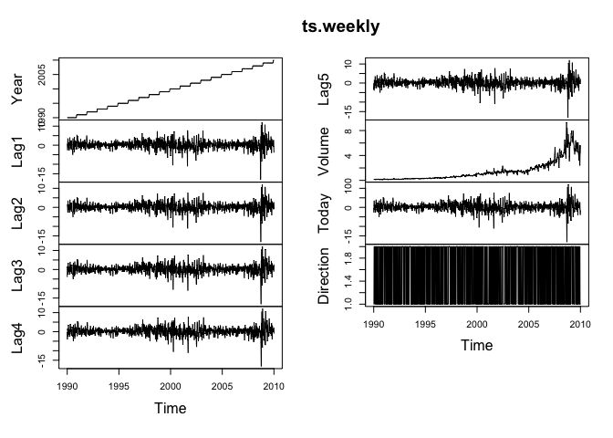

Homework 4
================
Painter, Ty
Mon Mar 8 09:29:09 2021

# Using the RMarkdown/knitr/github mechanism, complete the following exercises from chapter 4, section 4.7 (beginning pp 168) or the <https://www.statlearning.com/>:

  - Exercise 4: “When the number of features p is large, there tends to
    be a deterioration in the performance of KNN and other local
    approaches that perform prediction using only observations that are
    near the test observation for which a prediction must be made. This
    phenomenon is known as the curse of dimensionality, and it ties into
    the fact that non-parametric approaches often perform poorly when p
    is large. We will now investigate this curse.”

<!-- end list -->

1)  Suppose that we have a set of observations, each with measurements
    on p = 1 feature, X. We assume that X is uniformly (evenly)
    distributed on \[0, 1\]. Associated with each observation is a
    response value. Suppose that we wish to predict a test observation’s
    response using only observations that are within 10 % of the range
    of X closest to that test observation. For instance, in order to
    predict the response for a test observation with X = 0.6, we will
    use observations in the range \[0.55, 0.65\]. On average, what
    fraction of the available observations will we use to make the
    prediction?

<!-- end list -->

  - For values of X between 0.05 and 0.95 there will be a full 10% of
    values, but X values \< 0.05 and \> 0.95 will have a restricted
    range. To calculate these small percentages I found the average
    values for 0-0.5, 0.05-0.95, and 0.95-1 values and added them
    together to get 9.7%.

<!-- end list -->

2)  Now suppose that we have a set of observations, each with
    measurements on p = 2 features, X1 and X2. We assume that (X1, X2)
    are uniformly distributed on \[0, 1\] × \[0, 1\]. We wish to predict
    a test observation’s response using only observations that are
    within 10 % of the range of X1 and within 10 % of the range of X2
    closest to that test observation. For instance, in order to predict
    the response for a test observation with X1 = 0.6 and X2 = 0.35, we
    will use observations in the range \[0.55, 0.65\] for X1 and in the
    range \[0.3, 0.4\] for X2. On average, what fraction of the
    available observations will we use to make the prediction?

<!-- end list -->

  - The available observations are represented by the fraction (0.097)^p
    = 0.94%.

<!-- end list -->

3)  Now suppose that we have a set of observations on p = 100 features.
    Again the observations are uniformly distributed on each feature,
    and again each feature ranges in value from 0 to 1. We wish to
    predict a test observation’s response using observations within the
    10 % of each feature’s range that is closest to that test
    observation. What fraction of the available observations will we use
    to make the prediction?

<!-- end list -->

  - The available observations are represented by the fraction
    (0.097)<sup>p</sup>p = 4.76e-100%.

<!-- end list -->

4)  Using your answers to parts (a)–(c), argue that a drawback of KNN
    when p is large is that there are very few training observations
    “near” any given test observation.

<!-- end list -->

  - As the p dimensions increase the percentage of available observation
    exponentially decreases implying increasing the the number of
    dimensions is actually minimizing the percentage of observations
    that can be used. The smaller the percentage of available
    observations, the farther away the neighboring observations will be.

<!-- end list -->

5)  Now suppose that we wish to make a prediction for a test observation
    by creating a p-dimensional hypercube centered around the test
    observation that contains, on average, 10 % of the training
    observations. For p = 1, 2, and 100, what is the length of each side
    of the hypercube? Comment on your answer.

<!-- end list -->

  - THe fraction used will be (0.097)^(1/p) so the larger p, the larger
    the side length. When p=1, the length is 0.097, p=2 the length is
    0.311, and p=100 the length is 0.977. This implies the the longer
    the sides, the farther away the neighboring observations are.

*Note: A hypercube is a generalization of a cube to an arbitrary number
of dimensions. When p = 1, a hypercube is simply a line segment, when p
= 2 it is a square, and when p = 100 it is a 100-dimensional cube.*

  - Exercise 10: This question should be answered using the Weekly data
    set, which is part of the ISLR package. This data is similar in
    nature to the Smarket data from this chapter’s lab, except that it
    contains 1, 089 weekly returns for 21 years, from the beginning of
    1990 to the end of 2010.

<!-- end list -->

1)  Produce some numerical and graphical summaries of the Weekly data.
    Do there appear to be any patterns?

<!-- end list -->

``` r
library(ISLR)
library(tidyverse)
```

    ## ── Attaching packages ─────────────────────────────────────── tidyverse 1.3.0 ──

    ## ✓ ggplot2 3.3.2     ✓ purrr   0.3.4
    ## ✓ tibble  3.0.6     ✓ dplyr   1.0.3
    ## ✓ tidyr   1.1.2     ✓ stringr 1.4.0
    ## ✓ readr   1.4.0     ✓ forcats 0.5.0

    ## ── Conflicts ────────────────────────────────────────── tidyverse_conflicts() ──
    ## x dplyr::filter() masks stats::filter()
    ## x dplyr::lag()    masks stats::lag()

``` r
data("Weekly")
summary(Weekly)
```

    ##       Year           Lag1               Lag2               Lag3         
    ##  Min.   :1990   Min.   :-18.1950   Min.   :-18.1950   Min.   :-18.1950  
    ##  1st Qu.:1995   1st Qu.: -1.1540   1st Qu.: -1.1540   1st Qu.: -1.1580  
    ##  Median :2000   Median :  0.2410   Median :  0.2410   Median :  0.2410  
    ##  Mean   :2000   Mean   :  0.1506   Mean   :  0.1511   Mean   :  0.1472  
    ##  3rd Qu.:2005   3rd Qu.:  1.4050   3rd Qu.:  1.4090   3rd Qu.:  1.4090  
    ##  Max.   :2010   Max.   : 12.0260   Max.   : 12.0260   Max.   : 12.0260  
    ##       Lag4               Lag5              Volume            Today         
    ##  Min.   :-18.1950   Min.   :-18.1950   Min.   :0.08747   Min.   :-18.1950  
    ##  1st Qu.: -1.1580   1st Qu.: -1.1660   1st Qu.:0.33202   1st Qu.: -1.1540  
    ##  Median :  0.2380   Median :  0.2340   Median :1.00268   Median :  0.2410  
    ##  Mean   :  0.1458   Mean   :  0.1399   Mean   :1.57462   Mean   :  0.1499  
    ##  3rd Qu.:  1.4090   3rd Qu.:  1.4050   3rd Qu.:2.05373   3rd Qu.:  1.4050  
    ##  Max.   : 12.0260   Max.   : 12.0260   Max.   :9.32821   Max.   : 12.0260  
    ##  Direction 
    ##  Down:484  
    ##  Up  :605  
    ##            
    ##            
    ##            
    ## 

``` r
cor(Weekly[,-9])
```

    ##               Year         Lag1        Lag2        Lag3         Lag4
    ## Year    1.00000000 -0.032289274 -0.03339001 -0.03000649 -0.031127923
    ## Lag1   -0.03228927  1.000000000 -0.07485305  0.05863568 -0.071273876
    ## Lag2   -0.03339001 -0.074853051  1.00000000 -0.07572091  0.058381535
    ## Lag3   -0.03000649  0.058635682 -0.07572091  1.00000000 -0.075395865
    ## Lag4   -0.03112792 -0.071273876  0.05838153 -0.07539587  1.000000000
    ## Lag5   -0.03051910 -0.008183096 -0.07249948  0.06065717 -0.075675027
    ## Volume  0.84194162 -0.064951313 -0.08551314 -0.06928771 -0.061074617
    ## Today  -0.03245989 -0.075031842  0.05916672 -0.07124364 -0.007825873
    ##                Lag5      Volume        Today
    ## Year   -0.030519101  0.84194162 -0.032459894
    ## Lag1   -0.008183096 -0.06495131 -0.075031842
    ## Lag2   -0.072499482 -0.08551314  0.059166717
    ## Lag3    0.060657175 -0.06928771 -0.071243639
    ## Lag4   -0.075675027 -0.06107462 -0.007825873
    ## Lag5    1.000000000 -0.05851741  0.011012698
    ## Volume -0.058517414  1.00000000 -0.033077783
    ## Today   0.011012698 -0.03307778  1.000000000

``` r
ts.weekly <- ts(Weekly, start=1990, end=2010, frequency=52)
plot.ts(ts.weekly)
```

<!-- --> - All of the
lags seem to be similar and the volume of trading has been on a gradual
increase. There has also been high volatility in recent years
surrounding the 2008 financial crisis

2)  Use the full data set to perform a logistic regression with
    Direction as the response and the five lag variables plus Volume as
    predictors. Use the summary function to print the results. Do any of
    the predictors appear to be statistically significant? If so, which
    ones?

<!-- end list -->

``` r
library(stats)
Weekly$Direction <- as.factor(Weekly$Direction)
log_fit <- glm(Direction ~ Lag1+Lag2+Lag3+Lag4+Lag5+Volume,
               data=Weekly, 
               family=binomial)
summary(log_fit)
```

    ## 
    ## Call:
    ## glm(formula = Direction ~ Lag1 + Lag2 + Lag3 + Lag4 + Lag5 + 
    ##     Volume, family = binomial, data = Weekly)
    ## 
    ## Deviance Residuals: 
    ##     Min       1Q   Median       3Q      Max  
    ## -1.6949  -1.2565   0.9913   1.0849   1.4579  
    ## 
    ## Coefficients:
    ##             Estimate Std. Error z value Pr(>|z|)   
    ## (Intercept)  0.26686    0.08593   3.106   0.0019 **
    ## Lag1        -0.04127    0.02641  -1.563   0.1181   
    ## Lag2         0.05844    0.02686   2.175   0.0296 * 
    ## Lag3        -0.01606    0.02666  -0.602   0.5469   
    ## Lag4        -0.02779    0.02646  -1.050   0.2937   
    ## Lag5        -0.01447    0.02638  -0.549   0.5833   
    ## Volume      -0.02274    0.03690  -0.616   0.5377   
    ## ---
    ## Signif. codes:  0 '***' 0.001 '**' 0.01 '*' 0.05 '.' 0.1 ' ' 1
    ## 
    ## (Dispersion parameter for binomial family taken to be 1)
    ## 
    ##     Null deviance: 1496.2  on 1088  degrees of freedom
    ## Residual deviance: 1486.4  on 1082  degrees of freedom
    ## AIC: 1500.4
    ## 
    ## Number of Fisher Scoring iterations: 4

  - No coefficients stand out as significantly significant, but Lags 1
    and 2 have the strongest significance.

<!-- end list -->

3)  Compute the confusion matrix and overall fraction of correct
    predictions. Explain what the confusion matrix is telling you about
    the types of mistakes made by logistic regression.

<!-- end list -->

``` r
library(heuristica)
glm_probs <- predict(log_fit, type='response') # probability of market going up
glm_preds <- ifelse(glm_probs >.5, "Up", "Down") # convert probs to up or down
table(glm_preds, Weekly$Direction) # confusion matrix
```

    ##          
    ## glm_preds Down  Up
    ##      Down   54  48
    ##      Up    430 557

  - The matrix shows that the logistic regression’s biggest mistakes are
    predicting up when the market went down.

<!-- end list -->

4)  Now fit the logistic regression model using a training data period
    from 1990 to 2008, with Lag2 as the only predictor. Compute the
    confusion matrix and the overall fraction of correct predictions for
    the held out data (that is, the data from 2009 and 2010).

<!-- end list -->

``` r
train <- subset(Weekly, Weekly$Year <= 2008)
test <- subset(Weekly, Weekly$Year > 2008)
log_fit <- glm(Direction ~ Lag2, # fit model with training data
               data=train, 
               family=binomial)
#summary(log_fit)
#log_fit
log_probs <- predict(log_fit, test, type='response') # probability of market going up using train model on test data
log_preds <- ifelse(log_probs >.5, "Up", "Down") # convert probs to up or down
table(log_preds, test$Direction) # confusion matrix
```

    ##          
    ## log_preds Down Up
    ##      Down    9  5
    ##      Up     34 56

``` r
mean(log_preds == test$Direction)
```

    ## [1] 0.625

5)  Repeat (d) using LDA.

<!-- end list -->

``` r
library(MASS)
```

    ## 
    ## Attaching package: 'MASS'

    ## The following object is masked from 'package:dplyr':
    ## 
    ##     select

``` r
lda_fit <- lda(Direction ~ Lag2, # fit model with training data
               data=train)
#lda_fit
lda_preds <- predict(lda_fit, test)
table(lda_preds$class, test$Direction)
```

    ##       
    ##        Down Up
    ##   Down    9  5
    ##   Up     34 56

``` r
mean(lda_preds$class == test$Direction)
```

    ## [1] 0.625

6)  Repeat (d) using QDA.

<!-- end list -->

``` r
qda_fit <- qda(Direction ~ Lag2, # fit model with training data
               data=train)
qda_preds <- predict(qda_fit, test)
table(qda_preds$class, test$Direction)
```

    ##       
    ##        Down Up
    ##   Down    0  0
    ##   Up     43 61

``` r
mean(qda_preds$class == test$Direction)
```

    ## [1] 0.5865385

7)  Repeat (d) using KNN with K = 1.

<!-- end list -->

``` r
library(class)
set.seed(42)
knn_preds <- knn(as.data.frame(train$Lag2), as.data.frame(test$Lag2), train$Direction, k=1)
table(knn_preds, test$Direction)
```

    ##          
    ## knn_preds Down Up
    ##      Down   21 30
    ##      Up     22 31

``` r
mean(knn_preds == test$Direction)
```

    ## [1] 0.5

8)  Which of these methods appears to provide the best results on this
    data?

<!-- end list -->

  - Logistic regression and LDA provide the best results both predicting
    correctly 62.5% of the time.

<!-- end list -->

1)  Experiment with different combinations of predictors, including
    possible transformations and interactions, for each of the methods.
    Report the variables, method, and associated confusion matrix that
    appears to provide the best results on the held out data. Note that
    you should also experiment with values for K in the KNN classifier."

<!-- end list -->

  - I chose to use Lags 1 and 2 because they were the most statistically
    significant in my original analysis.

<!-- end list -->

``` r
# logistic regression
log_fitx <- glm(Direction ~ Lag1+Lag2, # fit model with training data
               data=train, 
               family=binomial)
#summary(log_fitx)
#log_fitx
log_probsx <- predict(log_fitx, test, type='response') # probability of market going up using train model on test data
log_predsx <- ifelse(log_probsx >.5, "Up", "Down") # convert probs to up or down
table(log_predsx, test$Direction) # confusion matrix
```

    ##           
    ## log_predsx Down Up
    ##       Down    7  8
    ##       Up     36 53

``` r
mean(log_predsx == test$Direction)
```

    ## [1] 0.5769231

``` r
# LDA
lda_fitx <- lda(Direction ~ Lag1+Lag2, # fit model with training data
               data=train)
#lda_fit
lda_predsx <- predict(lda_fitx, test)
table(lda_predsx$class, test$Direction)
```

    ##       
    ##        Down Up
    ##   Down    7  8
    ##   Up     36 53

``` r
mean(lda_predsx$class == test$Direction)
```

    ## [1] 0.5769231

``` r
qda_fitx <- qda(Direction ~ Lag1+Lag2, # fit model with training data
               data=train)
qda_predsx <- predict(qda_fitx, test)
table(qda_predsx$class, test$Direction)
```

    ##       
    ##        Down Up
    ##   Down    7 10
    ##   Up     36 51

``` r
mean(qda_predsx$class == test$Direction)
```

    ## [1] 0.5576923

``` r
trainx <- cbind(train$Lag1,train$Lag2)
testx <- cbind(test$Lag1,test$Lag2)

set.seed(15)

knn_predsx <- knn(trainx, testx, train$Direction, k=9)
table(knn_predsx, test$Direction)
```

    ##           
    ## knn_predsx Down Up
    ##       Down   18 23
    ##       Up     25 38

``` r
mean(knn_predsx == test$Direction)
```

    ## [1] 0.5384615

  - k=9 produces the best prediction rate for the KNN method
  - Once again the logistic regression and LDA method produce the best
    results both prediciting correctly 57.7% of the time.
