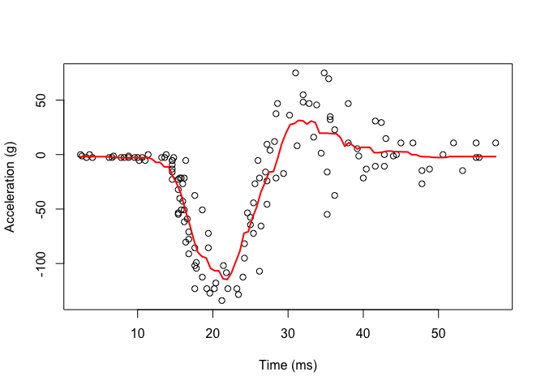
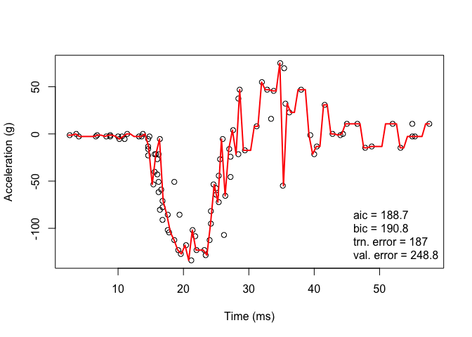
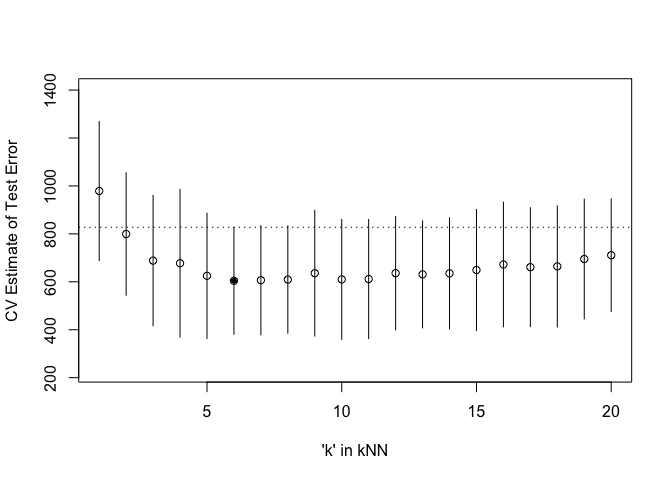

Homework 5
================
Painter, Ty
Thu Mar 18 00:25:46 2021

``` r
library(tidyverse)
```

    ## ── Attaching packages ─────────────────────────────────────── tidyverse 1.3.0 ──

    ## ✓ ggplot2 3.3.2     ✓ purrr   0.3.4
    ## ✓ tibble  3.0.6     ✓ dplyr   1.0.3
    ## ✓ tidyr   1.1.2     ✓ stringr 1.4.0
    ## ✓ readr   1.4.0     ✓ forcats 0.5.0

    ## ── Conflicts ────────────────────────────────────────── tidyverse_conflicts() ──
    ## x dplyr::filter() masks stats::filter()
    ## x dplyr::lag()    masks stats::lag()

``` r
library('MASS') ## for 'mcycle'
```

    ## 
    ## Attaching package: 'MASS'

    ## The following object is masked from 'package:dplyr':
    ## 
    ##     select

``` r
library('manipulate') ## for 'manipulate'
library('caret') ## 'knnreg' and 'createFolds'
```

    ## Loading required package: lattice

    ## 
    ## Attaching package: 'caret'

    ## The following object is masked from 'package:purrr':
    ## 
    ##     lift

# 1\. Randomly split the mcycle data into training (75%) and validation (25%) subsets.

``` r
# load data
y <- mcycle$accel
x <- matrix(mcycle$times, length(mcycle$times), 1)

# create training and testing data
sample = sort(sample(nrow(mcycle), nrow(mcycle)*.75))
train_x <- matrix(x[sample,])
test_x <- matrix(x[-sample,])
train_y <- y[sample]
test_y <- y[-sample]
```

# 2\. Using the mcycle data, consider predicting the mean acceleration as a function of time. Use the Nadaraya-Watson method with the k-NN kernel function to create a series of prediction models by varying the tuning parameter over a sequence of values. (hint: the script already implements this)

``` r
## Epanechnikov kernel function
## x  - n x p matrix of training inputs
## x0 - 1 x p input where to make prediction
## lambda - bandwidth (neighborhood size)
kernel_epanechnikov <- function(x, x0, lambda=1) {
  d <- function(t)
    ifelse(t <= 1, 3/4*(1-t^2), 0)
  z <- t(t(x) - x0)
  d(sqrt(rowSums(z*z))/lambda)
}

## k-NN kernel function
## x  - n x p matrix of training inputs
## x0 - 1 x p input where to make prediction
## k  - number of nearest neighbors
kernel_k_nearest_neighbors <- function(x, x0, k=1) {
  ## compute distance betwen each x and x0
  z <- t(t(x) - x0)
  d <- sqrt(rowSums(z*z))

  ## initialize kernel weights to zero
  w <- rep(0, length(d))
  
  ## set weight to 1 for k nearest neighbors
  w[order(d)[1:k]] <- 1
  
  return(w)
}

## Make predictions using the NW method
## y  - n x 1 vector of training outputs
## x  - n x p matrix of training inputs
## x0 - m x p matrix where to make predictions
## kern  - kernel function to use
## ... - arguments to pass to kernel function
nadaraya_watson <- function(y, x, x0, kern, ...) { # computes values of kernel function at each pair of the training data at places where we want to make predictions
  k <- t(apply(x0, 1, function(x0_) { # symmetric matrix to quantify how close pairs are in train data
    k_ <- kern(x, x0_, ...)
    k_/sum(k_)
  }))
  yhat <- drop(k %*% y) # multiply kernel matrix by train outcomes, linear smoother
  attr(yhat, 'k') <- k # attach kernel matrix to yhat, want kernel matrix to compute trace to get effect. DoF
  return(yhat)
}

## create a grid of inputs 
x_plot <- matrix(seq(min(x),max(x),length.out=100),100,1)

## make predictions using NW method at each of grid points
y_hat_plot <- nadaraya_watson(y, x, x_plot,
  kernel_epanechnikov, lambda=1)

## create series of prediction models
# manipulate({
#   y_hat <- nadaraya_watson(y, x, x,
#     kern=kernel_k_nearest_neighbors, k=k_slider)
#   y_hat_plot <- nadaraya_watson(y, x, x_plot,
#     kern=kernel_k_nearest_neighbors, k=k_slider)
#   plot(x, y, xlab="Time (ms)", ylab="Acceleration (g)")
#   lines(x_plot, y_hat_plot, col="red", lwd=2)
# }, k_slider=slider(1, 20, initial=3, step=1))

y_hat <- nadaraya_watson(y, x, x,
  kern=kernel_k_nearest_neighbors, k=12)
y_hat_plot <- nadaraya_watson(y, x, x_plot,
  kern=kernel_k_nearest_neighbors, k=12)
plot(x, y, xlab="Time (ms)", ylab="Acceleration (g)")
lines(x_plot, y_hat_plot, col="red", lwd=2)
```

<!-- -->

  - I used the manipulate function to examine various tuning parameters
    of k and thought k=12 seemed to be a reasonable model. I also made a
    static plot so this could knit to a git\_hub document.

# 3\. With the squared-error loss function, compute and plot the training error, AIC, BIC, and validation error (using the validation data) as functions of the tuning parameter.

``` r
## Compute effective df using NW method
## y  - n x 1 vector of training outputs
## x  - n x p matrix of training inputs
## kern  - kernel function to use
## ... - arguments to pass to kernel function
effective_df <- function(y, x, kern, ...) { 
  y_hat <- nadaraya_watson(y, x, x,
    kern=kern, ...)
  sum(diag(attr(y_hat, 'k'))) # computes trace
}

## loss function
## y    - train/test y
## yhat - predictions at train/test x
loss_squared_error <- function(y, yhat)
  (y - yhat)^2

## test/train error
## y    - train/test y
## yhat - predictions at train/test x
## loss - loss function
error <- function(y, yhat, loss=loss_squared_error)
  mean(loss(y, yhat))

## AIC
## y    - training y
## yhat - predictions at training x
## d    - effective degrees of freedom
aic <- function(y, yhat, d)
  error(y, yhat) + 2/length(y)*d

## BIC
## y    - training y
## yhat - predictions at training x
## d    - effective degrees of freedom
bic <- function(y, yhat, d)
  error(y, yhat) + log(length(y))/length(y)*d

## create series of prediction models
#  manipulate({
# #   ## make predictions using NW method at training inputs
#     y_hat <- nadaraya_watson(train_y, train_x, train_x,
#       kern=kernel_k_nearest_neighbors, k=k_slider)
#     edf <- effective_df(train_y, train_x,
#       kern=kernel_k_nearest_neighbors, k=k_slider)
#     aic_ <- aic(train_y, y_hat, edf)
#     bic_ <- bic(train_y, y_hat, edf)
#     trn_error_ <- error(train_y, y_hat)
#     y_hat_tst <- nadaraya_watson(test_y, test_x, test_x,
#       kern=kernel_k_nearest_neighbors, k=k_slider)
#     val_error_ <- error(test_y, y_hat_tst)
#     y_hat_plot <- nadaraya_watson(train_y, train_x, x_plot,
#       kern=kernel_k_nearest_neighbors, k=k_slider)
#     plot(train_x, train_y, xlab="Time (ms)", ylab="Acceleration (g)")
#     legend('bottomright', legend = c(
#       paste0('aic = ', round(aic_, 1)),
#       paste0('bic = ', round(bic_, 1)),
#       paste0('trn. error = ', round(trn_error_, 1)),
#       paste0('val. error = ', round(val_error_ , 1))),
#       bty='n')
#     lines(x_plot, y_hat_plot, col="red", lwd=2)
#  }, k_slider=slider(1, 20, initial=3, step=1))

y_hat <- nadaraya_watson(train_y, train_x, train_x,
  kern=kernel_k_nearest_neighbors, k=1)
edf <- effective_df(train_y, train_x,
  kern=kernel_k_nearest_neighbors, k=1)
aic_ <- aic(train_y, y_hat, edf)
bic_ <- bic(train_y, y_hat, edf)
trn_error_ <- error(train_y, y_hat)
y_hat_tst <- nadaraya_watson(test_y, test_x, test_x,
  kern=kernel_k_nearest_neighbors, k=1)
val_error_ <- error(test_y, y_hat_tst)
y_hat_plot <- nadaraya_watson(train_y, train_x, x_plot,
  kern=kernel_k_nearest_neighbors, k=1)
plot(train_x, train_y, xlab="Time (ms)", ylab="Acceleration (g)")
legend('bottomright', legend = c(
  paste0('aic = ', round(aic_, 1)),
  paste0('bic = ', round(bic_, 1)),
  paste0('trn. error = ', round(trn_error_, 1)),
  paste0('val. error = ', round(val_error_ , 1))),
  bty='n')
lines(x_plot, y_hat_plot, col="red", lwd=2)
```

<!-- -->

  - When adjusting the k tuning parameter, the validation error was the
    lowest when k=1.

# 4\. For each value of the tuning parameter, Perform 5-fold cross-validation using the combined training and validation data. This results in 5 estimates of test error per tuning parameter value.

``` r
## 5-fold cross-validation of knnreg model
## create five folds
set.seed(101)
mcycle_accel  <- createFolds(mcycle$accel, k=5)
print(mcycle_accel)
```

    ## $Fold1
    ##  [1]   1   3  11  15  17  18  20  21  22  34  37  41  45  59  60  61  66  72  75
    ## [20]  79  83 110 114 119 123 128 129 133
    ## 
    ## $Fold2
    ##  [1]   2   5   9  14  32  33  36  39  57  63  67  68  71  74  80  82  86  89  92
    ## [20]  95  98 100 113 117 120 121
    ## 
    ## $Fold3
    ##  [1]   4   7  16  25  29  35  40  47  49  53  55  56  65  73  77  91  99 103 105
    ## [20] 106 109 112 118 122 125 127
    ## 
    ## $Fold4
    ##  [1]   6  13  23  26  27  28  38  42  51  52  58  62  69  70  76  81  84  93  94
    ## [20]  96 102 104 116 126 130 132
    ## 
    ## $Fold5
    ##  [1]   8  10  12  19  24  30  31  43  44  46  48  50  54  64  78  85  87  88  90
    ## [20]  97 101 107 108 111 115 124 131

``` r
sapply(mcycle_accel, length)  ## not all the same length
```

    ## Fold1 Fold2 Fold3 Fold4 Fold5 
    ##    28    26    26    26    27

``` r
cvknnreg <- function(kNN = 10, flds=mcycle_accel) {
  cverr <- rep(NA, length(flds))
  for(tst_idx in 1:length(flds)) { ## for each fold
    
    ## get training and testing data
    cycle_trn <- mcycle[-flds[[tst_idx]],]
    cycle_tst <- mcycle[ flds[[tst_idx]],]
    
    ## fit kNN model to training data
    knn_fit <- knnreg(accel ~ times,
                      k=kNN, data=cycle_trn)
    
    ## compute test error on testing data
    pre_tst <- predict(knn_fit, cycle_tst)
    cverr[tst_idx] <- mean((cycle_tst$accel - pre_tst)^2)
  }
  return(cverr)
}

## Compute 5-fold CV for kNN = 1:20
cverrs <- sapply(1:20, cvknnreg)
print(cverrs) ## rows are k-folds (1:5), cols are kNN (1:20)
```

    ##           [,1]      [,2]     [,3]      [,4]     [,5]     [,6]     [,7]     [,8]
    ## [1,]  644.5263  362.7091 247.9967  250.5990 230.5729 247.2910 228.4736 259.9412
    ## [2,]  936.9095  904.3907 801.4831  801.0175 741.0516 727.8889 783.8949 809.8326
    ## [3,] 1105.3844 1002.3367 672.1468  516.6917 519.2945 547.5719 562.9982 534.0339
    ## [4,]  807.0113  795.3321 738.6296  753.4791 718.4237 673.1811 707.3340 659.0055
    ## [5,] 1400.4722  931.9434 981.9589 1065.6845 915.3383 825.5683 750.7768 784.1008
    ##          [,9]    [,10]    [,11]    [,12]    [,13]    [,14]    [,15]    [,16]
    ## [1,] 245.6099 239.0978 236.7290 263.2810 278.8836 279.6448 267.9705 275.4788
    ## [2,] 913.7568 853.2308 867.5371 875.4113 866.5064 889.5540 922.1286 966.0839
    ## [3,] 535.8579 503.5755 522.5259 582.9620 586.6699 567.8054 552.6287 597.5642
    ## [4,] 660.8182 641.0107 639.6792 671.8717 661.4259 668.8642 700.9546 710.5580
    ## [5,] 823.6619 813.5586 791.6084 786.1451 761.7706 769.1951 802.3474 811.5294
    ##         [,17]    [,18]     [,19]     [,20]
    ## [1,] 278.2055 282.2681  324.2027  361.6169
    ## [2,] 939.9068 957.1392 1018.3599 1009.3806
    ## [3,] 591.2808 581.3680  644.7238  650.7859
    ## [4,] 716.1273 721.5442  744.6167  750.3475
    ## [5,] 779.6646 779.4502  743.3490  782.5608

``` r
cverrs_mean <- apply(cverrs, 2, mean)
cverrs_sd   <- apply(cverrs, 2, sd)
```

# 5\. Plot the CV-estimated test error (average of the five estimates from each fold) as a function of the tuning parameter. Add vertical line segments to the figure (using the segments function in R) that represent one “standard error” of the CV-estimated test error (standard deviation of the five estimates from each fold).

``` r
## Plot the results of 5-fold CV for kNN = 1:20
plot(x=1:20, y=cverrs_mean, 
     ylim=range(cverrs),
     xlab="'k' in kNN", ylab="CV Estimate of Test Error")
segments(x0=1:20, x1=1:20,
         y0=cverrs_mean-cverrs_sd,
         y1=cverrs_mean+cverrs_sd)
best_idx <- which.min(cverrs_mean)
points(x=best_idx, y=cverrs_mean[best_idx], pch=20)
abline(h=cverrs_mean[best_idx] + cverrs_sd[best_idx], lty=3)
```

<!-- -->

# 6\. Interpret the resulting figures and select a suitable value for the tuning parameter.

  - The minimum test error is at k=5. So I would select the highest k
    value within 1 standard deviation of k=5. That value would be k=20.
    This is because as k increases the model becomes less
    flexible/complex.
