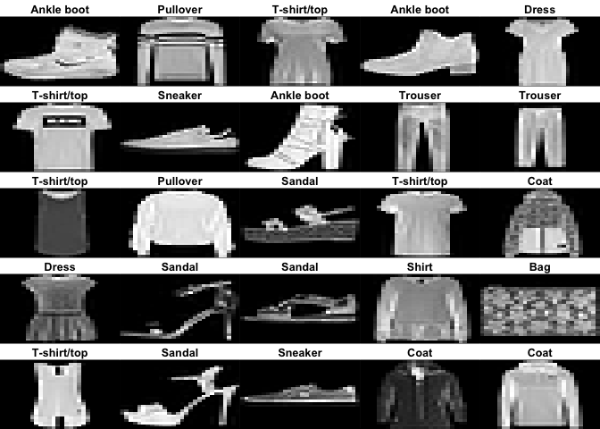
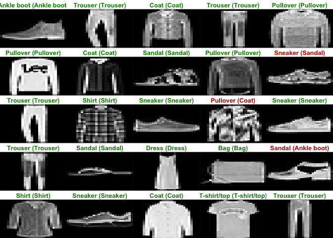
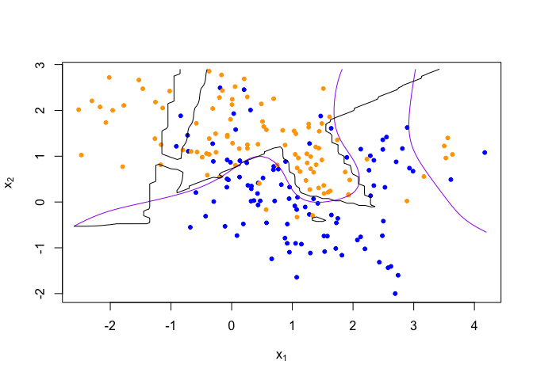
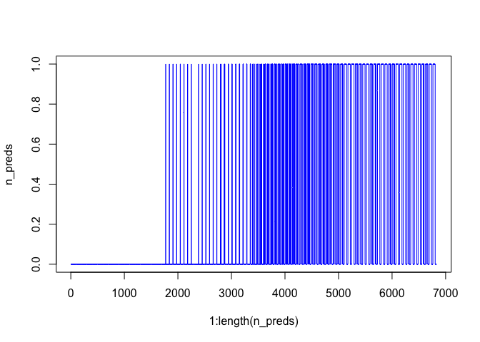

Homework 7
================
Painter, Ty
Tue Apr 27 10:52:41 2021

# Goal: Get started using Keras to construct simple neural networks

``` r
library(keras)
```

## 1\. Work through the “Image Classification” tutorial on the RStudio Keras website.

``` r
# load data
fashion_mnist <- dataset_fashion_mnist()

c(train_images, train_labels) %<-% fashion_mnist$train
c(test_images, test_labels) %<-% fashion_mnist$test
```

``` r
# map labels
class_names = c('T-shirt/top',
                'Trouser',
                'Pullover',
                'Dress',
                'Coat', 
                'Sandal',
                'Shirt',
                'Sneaker',
                'Bag',
                'Ankle boot')
```

``` r
# explore data
dim(train_images) # 28x28 pixels
```

    ## [1] 60000    28    28

``` r
dim(train_labels)
```

    ## [1] 60000

``` r
train_labels[1:20] # label is int between 0-9
```

    ##  [1] 9 0 0 3 0 2 7 2 5 5 0 9 5 5 7 9 1 0 6 4

``` r
dim(test_images) # 28x28 pixels
```

    ## [1] 10000    28    28

``` r
dim(test_labels)
```

    ## [1] 10000

``` r
# preprocess data
library(tidyr)
library(ggplot2) 

image_1 <- as.data.frame(train_images[1, , ])
colnames(image_1) <- seq_len(ncol(image_1))
image_1$y <- seq_len(nrow(image_1))
image_1 <- gather(image_1, "x", "value", -y)
image_1$x <- as.integer(image_1$x)

ggplot(image_1, aes(x = x, y = y, fill = value)) +
  geom_tile() +
  scale_fill_gradient(low = "white", high = "black", na.value = NA) +
  scale_y_reverse() +
  theme_minimal() +
  theme(panel.grid = element_blank())   +
  theme(aspect.ratio = 1) +
  xlab("") +
  ylab("") # pixel values fall between 0-255
```

<!-- -->

``` r
# preprocess train and test the same way
train_images <- train_images / 255
test_images <- test_images / 255
```

``` r
# display first 25 images from train set with class name
par(mfcol=c(5,5))
par(mar=c(0, 0, 1.5, 0), xaxs='i', yaxs='i')
for (i in 1:25) { 
  img <- train_images[i, , ]
  img <- t(apply(img, 2, rev)) 
  image(1:28, 1:28, img, col = gray((0:255)/255), xaxt = 'n', yaxt = 'n',
        main = paste(class_names[train_labels[i] + 1]))
}
```

<!-- -->

``` r
#### BUILD MODEL

# setup layers
model <- keras_model_sequential()
model %>%
  layer_flatten(input_shape = c(28, 28)) %>% # flatten transforms in 28x28 2D array (784 pixels)
  layer_dense(units = 128, activation = 'relu') %>% # dense params learned during training
  layer_dense(units = 10, activation = 'softmax')

# compile model
model %>% compile(
  optimizer = 'adam', # how model is updated based on data and loss
  loss = 'sparse_categorical_crossentropy', 
  metrics = c('accuracy') 
)

# train model
model %>% fit(train_images, train_labels, epochs = 5, verbose = 2) # ~89% accuracy

# evaluate accuracy
score <- model %>% evaluate(test_images, test_labels, verbose = 0)
cat('Test loss:', score['loss'], "\n")
```

    ## Test loss: 0.3469338

``` r
cat('Test accuracy:', score['accuracy'], "\n") # less accurate than train data, overfit
```

    ## Test accuracy: 0.8767

``` r
# make predictions
predictions <- model %>% predict(test_images)
predictions[1, ] # look at predicted label for 1st image; each value is confidence in each of 10 labels
```

    ##  [1] 4.759656e-09 1.825374e-08 6.359154e-10 6.607809e-10 1.330060e-08
    ##  [6] 2.028991e-03 3.793811e-08 2.366113e-02 4.205029e-06 9.743056e-01

``` r
which.max(predictions[1, ]) # examine which label has highest confidence
```

    ## [1] 10

``` r
class_pred <- model %>% predict_classes(test_images) # get class predictions
class_pred[1:20]
```

    ##  [1] 9 2 1 1 6 1 4 6 5 7 4 5 7 3 4 1 2 2 8 0

``` r
test_labels[1] # check test label (ankle boot)
```

    ## [1] 9

``` r
# Plot Predictions
par(mfcol=c(5,5))
par(mar=c(0, 0, 1.5, 0), xaxs='i', yaxs='i')
for (i in 1:25) { 
  img <- test_images[i, , ]
  img <- t(apply(img, 2, rev)) 
  # subtract 1 as labels go from 0 to 9
  predicted_label <- which.max(predictions[i, ]) - 1
  true_label <- test_labels[i]
  if (predicted_label == true_label) {
    color <- '#008800' 
  } else {
    color <- '#bb0000'
  }
  image(1:28, 1:28, img, col = gray((0:255)/255), xaxt = 'n', yaxt = 'n',
        main = paste0(class_names[predicted_label + 1], " (",
                      class_names[true_label + 1], ")"),
        col.main = color)
}
```

<!-- -->

``` r
# Grab an image from the test dataset
# take care to keep the batch dimension, as this is expected by the model
img <- test_images[1, , , drop = FALSE]
dim(img)
```

    ## [1]  1 28 28

``` r
predictions <- model %>% predict(img) # predict image
predictions
```

    ##              [,1]         [,2]        [,3]         [,4]         [,5]
    ## [1,] 4.759656e-09 1.825374e-08 6.35913e-10 6.607809e-10 1.330062e-08
    ##             [,6]         [,7]       [,8]         [,9]     [,10]
    ## [1,] 0.002028993 3.793811e-08 0.02366113 4.205029e-06 0.9743056

``` r
# subtract 1 as labels are 0-based
prediction <- predictions[1, ] - 1
which.max(prediction) # find best prediction
```

    ## [1] 10

``` r
class_pred <- model %>% predict_classes(img) # get class predicition
class_pred
```

    ## [1] 9

## 2\. Use the Keras library to re-implement the simple neural network discussed during lecture for the mixture data (see nnet.R). Use a single 10-node hidden layer; fully connected.

``` r
library('rgl')
library('nnet')
library('dplyr')
```

    ## 
    ## Attaching package: 'dplyr'

    ## The following objects are masked from 'package:stats':
    ## 
    ##     filter, lag

    ## The following objects are masked from 'package:base':
    ## 
    ##     intersect, setdiff, setequal, union

``` r
## load binary classification example data
load("/Users/TyPainter1/Desktop/Masters/spring-2021/DS-5640/class-lectures/mixture.example.RData")
dat <- mixture.example
```

``` r
# FIT 10-node hidden layer; fully connected
# setup layers
k_fit <- keras_model_sequential()
k_fit %>% 
  layer_dense(units = 10, activation = 'relu') %>%
  layer_dense(units = 2, activation = 'softmax') 
  #layer_flatten(input_shape = c(2)) %>% 
  

# compile model
k_fit %>% compile(optimizer = 'adam', # how model is updated based on data and loss
                 loss = 'sparse_categorical_crossentropy', 
                 metrics = c('accuracy') 
                 )

# train model
k_fit %>% fit(x=dat$x, y=dat$y, epochs = 5, verbose = 2) 
```

## 3\. Create a figure to illustrate that the predictions are (or are not) similar using the ‘nnet’ function versus the Keras model.

``` r
# Predictions for Keras model
k_probs <- predict(k_fit, x= dat$xnew, type="class")
k_preds <- k_fit %>% predict_classes(dat$xnew)
```

``` r
# Predictions using nnet function
n_fit <- nnet(x=dat$x, y=dat$y, size=10, entropy=TRUE, decay=0) 
```

    ## # weights:  41
    ## initial  value 141.508352 
    ## iter  10 value 100.368814
    ## iter  20 value 86.520856
    ## iter  30 value 75.951693
    ## iter  40 value 71.066690
    ## iter  50 value 65.617377
    ## iter  60 value 64.040688
    ## iter  70 value 63.591994
    ## iter  80 value 63.240094
    ## iter  90 value 63.176273
    ## iter 100 value 63.006269
    ## final  value 63.006269 
    ## stopped after 100 iterations

``` r
n_preds <- predict(n_fit, dat$xnew, type="class")
```

``` r
plot(1:length(k_preds), k_preds, type ="l", col = "red")
```

<!-- -->

``` r
plot(1:length(n_preds), n_preds, type ="l", col = "blue")
```

<!-- -->

## 4\. (optional extra credit) Convert the neural network described in the “Image Classification” tutorial to a network that is similar to one of the convolutional networks described during lecture on 4/15 (i.e., Net-3, Net-4, or Net-5) and also described in the ESL book section 11.7. See the \!ConvNet tutorial on the RStudio Keras website.
